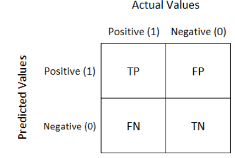

<!-- README.md is generated from README.Rmd. Please edit that file -->

```{r, include = FALSE}
knitr::opts_chunk$set(
  collapse = TRUE,
  comment = "#>"
)
```
# Modelamiento Estadístico y Sistemas Recomendadores 
Repositorio creado para el Trabajo Final del Curso de Modelamiento Estadístico y Sistemas Recomendadores en el programa de Diplomado en Big Data para la toma de decisiones de la Pontificia Universidad Católica de Chile.

**Eduardo Carrasco Vidal**

3/31/2020

<!-- badges: start -->
 
<!-- badges: end -->

**Requisito: Instalar las siguientes librerías**

- _rpart_
- _Hmisc_
- _e1071_
- _rminer_
- _kknn_
- _graphics_
- _factoextra_
- _NbClust_

La versión en desarrollo del documento puede instalarse desde GitHub:

```r
# install.packages("devtools")
# devtools::install_github("educarrascov/DiploBigData")
```

# Trabajo Final:
(**Resumen General**)

En la primera parte del trabajo, se utilizaron 2 modelos de clasificación (**Naive Bayes / K-NN**), para predecir cifosis en una población dada; para lo cual, se generaron métricas de comparación (Precisión, Especificidad, Sensibilidad) y una matríz de confusión.

En la segunda parte del trabajo; se utilizó un método de clustering basado en K-means a una muestra obtenida del gasto anual en diferentes productos. 

## I. Parte Nº 1:

Considere la base de datos Kyphosis, incluída en la librería _Rpart_. Esta base de datos contiene datos de **81 niños** a los cuales se les realizó una cirugía correctiva en la columna vertical y se les midieron las variables descritas en la siguiente tabla:

| variable | descripción|
| ---------| ---------  |
| `Age`    | Edad en meses|
| `Number` | Número de vertebras involucradas|
| `Start`  | Número de la primera Vértebra|
|`Kyphosis`| Indica si la persona estudiada presenta (present) o no (absent), la enfermedad denominada cifosis|

Se efectuó una simulación con la estadística descriptiva que involucra aspectos de las 4 variables.

``` {r}
library(rpart) # Cargamos la librería rpart
KyphosisDatos  <-  
kyphosis # Cargamos los datos necesarios para la simulación
summary(KyphosisDatos) # Resumen de la simulación.
```
Podemos generar diferentes tablas de cada variables, para efectuar una verificación inicial.
``` {r}
head(KyphosisDatos) #6 primero datos de todas las variables
```
De igual manera, se puede observar los nombres de cada variable
``` {r}
names(KyphosisDatos)
```
Se genera una tabla para observar los datos de la variable kyphosis.
``` {r}
table(KyphosisDatos$Kyphosis)
```
Se genera una tabla para observar los datos de la variable number.
``` {r}
table(KyphosisDatos$Number) 
```
Se genera una tabla para observar los datos de la variable start.
``` {r}
table(KyphosisDatos$Start)
```

Si se observan los comandos anteriores, podemos ver estadísticas descriptivas de las variables como: el número total de registros corresponde a 11, dentro de los cuales 64 presentan cifosis y 17 no presentan; respecto a los meses, el mínimo de mes en que un niño presenta esta enfermedad es de 1 y el máximo de 206 meses; respecto a la variable número, el número de vértebras involucradas tiene un mínimo de 2 y un máximo de 10; por último, podemos señalar que la primera vértebra operada en algunos casos es la 1 y en otros la 18.

La función table(), nos permite visualizar de manera general cada variable de la base de datos pero es más usual observar la función head(), que nos permite observar los 6 primeros valores de cada variable.

Para observar de mejor manera el comportamiento de las variables en un gráfico de frecuencias, podemos confeccionar un histograma, de acuerdo al siguiente detalle:

``` {r}
par(mfrow=c(1,3)) #permite generar gráficos en paralelo, 1 fila por 3 columnas
hist(KyphosisDatos$Age,  main  =  "Histograma  para  Age",  xlab  =  "Age") 
hist(KyphosisDatos$Number,  main  =  "Histograma  para  Number",  xlab  =  "Number")  
hist(KyphosisDatos$Start,  main  =  "Histograma  para  Start",  xlab  =  "Start") 
```

Si realizamos una descipción más amplia de las variables utilizando los cuartiles, la mediana y la media aritmética, podemos determinar que la edad promedio de los niños corresponde a 83.65 meses. 
Sin embargo, la mayor cantidad de niños operados tienen entre uno y dos meses de edad, considerando además que el 25% (1er quartil) de los niños estudiados tienen edades hasta los 26 meses, mientras que el 75% (3er quartil) se concentra con edades hasta los 130 meses. Respecto a la variable que involucra el número de vértebras, el 25% (1er quartil) de los niños ha tenido 3 mientras que el 75% (3er quartil) ha tenido hasta 5, con un número promedio de 4.049, pero siendo 3 vértebras la cantidad más frecuente. 

Todo lo anterior se puede identificar gráficamente en los histogramas de cada variable.

Por último, aplicamos una función que permite identificar datos faltantes de acuerdo al siguiente detalle:

``` {r}
library(Hmisc)#cargamos la librería Hmisc 
```
``` {r}
describe(KyphosisDatos) #verificamos que no existen datos faltantes
```
Como se observa en la función anterior, no hay datos perdidos en ninguna de las variables, por lo cual, podemos finalizar el preprocesamiento de datos.

**1) Seleccione de manera aleatoria 2/3 de los datos para crear sus datos de entrenamiento y guarde el tercio restante para crear los datos de validación. Utilice la semilla 1 para el generador de números aleatorios**:

<!-- end list -->
De acuerdo al enunciado, se generan dos bases de datos:

- La primera para entrenamiento correspondiente a 2/3.
- La segunda para prueba correspondiente a 1/3.

Luego, con la siguiente función observamos la cantidad de valores que se encuentran en los nuevos Data Set.
``` {r}
set.seed(1) #por defecto para generar las distintas bases de datos
ind  <-  sample(2,  length(KyphosisDatos$Kyphosis),  replace=TRUE,  prob=c(2/3, 1/3)) 
#Generamos la división de datos en 2/3 y 1/3
table(ind) #cantidad de valores por dataSet
```
Los grupos anteriores se definen de la siguiente forma:

- datos.trabajo.
- datos.validación.

``` {r}
datos.trabajo  <-  KyphosisDatos[ind==1,] 
datos.validacion  <-  KyphosisDatos[ind==2,] 
```
``` {r}
dim(datos.trabajo) #dimensión del set de trabajo.
```
``` {r}
dim(datos.validacion) #dimensión del set de validación.
```
**2) Construya un clasificador de *Bayes Ingenuo* para la variable Kyphosis. Realice las predicciones para su clasificador para los datos de validación:**

<!-- end list -->

``` {r}
library(e1071) #librería sammut and web 2017, clasificadora de naive bayes
fit.NB  <-  naiveBayes(Kyphosis  ~  .,  data=datos.trabajo, laplace = 1) 
#se asigna el clasificador a la var. fit.NB
pred.NB  <-  predict(fit.NB,  datos.validacion[,-1],  type="raw") 
#se realiza una predicción preliminar
```
Con esto observamos la probabilidad de obtener un absent o present, en base a las otras variables, la ventaja que nos da por sobre la función pred.NB es que esta muestra sólo los 6 primeros en la lista.

``` {r}
head(pred.NB)
```
Como lo anterior, no demuestra de manera visual lo correcto o incorrecto que clasifica en modelo seleccionado, sólo entrega una probabilidad de ser clasificado como cifosis ausente o presente, lo correcto es aplicar o ejecutar una función para conocer las métricas, de acuerdo a lo siguiente:

``` {r}
library(rminer) 
#esta función permite abrir la libreria rminer y poder medir las métricas
mmetric(datos.validacion[,1],  pred.NB,  "ACC") 
#precisiòn, ref. a Accuracy.
```
``` {r}
mmetric(datos.validacion[,1],  pred.NB,  "TPR") 
#sensibilidad, ref. a True Possitive Rate.
```

``` {r}
mmetric(datos.validacion[,1],  pred.NB,  "TNR") 
#Especificidad, ref. a True Negative Rate.
```
``` {r}
print(pred.NB.Conf  <-  mmetric(datos.validacion[,1],  pred.NB,  "CONF")) 
#permite hacer la matríz de confusión
```

``` {r}
print(pred.NB.Conf  <-  mmetric(datos.validacion[,1],  pred.NB,  "AUC"))
#Permite obtener el área bajo la curva ROC (Area Under Curve)
```
Con esta función podemos incluso obtener una matríz de confusión que permite efectuar el cálculo manual de cada uno de los parámetros anteriormente determinados.
``` {r}
ctable <- as.table(matrix(c(21,1,3,3), nrow = 2, byrow = TRUE)) 
#se deben colocar los valores obtenidos en la matriz
fourfoldplot(ctable, color = c("#CC6666", "#99CC99"),conf.level = 0, margin = 1, main = "Matriz de Confusión - Naive Bayes")
```
Efectuada la confección de la matriz de confusión y en base a los códigos ejecutados, se puede comparar con las verdaderas clases asociadas a cada entrada para así obtener indicadores cuantitativos respecto al desempeño del modelo.

Para lo anterior, se determinaron las siguientes métricas:

| Métrica       | Descripción                              |
| ------------  | ------------                             |
| `Precisión`   | (**ACC** - Classification Accuracy Rate) |
| `Sensibilidad`| (**TPR** - True Positive Rate)           |
|`Especificidad`| (**TNR** - True Negative Rate)           |


Si se observan los resultados obtenidos, vemos por un lado que la **`Precisión`** (**ACC - Clasification Accuraccy Rate**) del modelo es de **85.71%**.

Respecto a la variable **`Sensibilidad`** (**TPR - True Possitive Rate**), esta se puede calcular en forma manual de acuerdo a los resultados obtenidos por la matríz de confusión, que tiene la siguiente estructura:



$$ TPR = \frac{TP}{(TP + FP)} $$

$$ TPR = \frac{21}{(21+1)} = 95,45% $$

Respecto a la variable **`Especificidad`** (**TNR - True Negative Rate**), esta se puede calcular en forma manual de acuerdo a los resultados obtenidos por la matríz de confusión, que tiene la siguiente estructura:

$$ TNR =\frac{TN}{(TN + FN)} $$

$$ TNR =\frac{3}{(3+3)} = 50,00% $$

De acuerdo a los resultados anteriores, podemos concluir que existe una mayor probabilidad de que el clasificador efectúe una clasificación positiva (absent) cuando las variables de entrada tienen características de positivas (absent), llegando a un 95,45% (sensibilidad), lo cual se puede observar en la matríz de confusión. Por otro lado, existe una menor probabilidad de ser clasificado con una clasificación negativa (present) puesto que de los resultados, no hay realmente una distinción entre los verdaderos negativos y los falsos negativos, lo cual nos
entrega una probabilidad de clasificación negativa (especificidad) de un 50%.

El marcador global o `Precisión` (**ACC - Classification Accuracy Rate**) del clasificador, se puede determinar por la siguiente formula:

$$ ACC =\frac{(TP + TN)}{(TP + FP + TN + FN)} $$

$$ ACC =\frac{(21 + 3)}{(21 + 1 + 3 + 3)}= 85,71 $$

**3)  Construya un clasificador de *k-vecinos más cercanos (KNN)* para la variable Kyphosis. Realice las predicciones para su clasificador para los datos de validación:**

<!-- end list -->

``` {r}
library(kknn) #cargamos la librería del KNN 
fit.kknn<-kknn(Kyphosis~.,datos.trabajo,datos.validacion,distance= 1,kernel="triangular") 
#efectuamos una predicción utilizando el algoritmo KNN 
```
Como lo anterior, no demuestra de manera visual lo correcto o incorrecto que clasifica en modelo seleccionado, sólo entrega una probabilidad de ser clasificado como cifosis ausente (absent) o presente (present), lo correcto es aplicar o ejecutar una función para conocer las métricas, de acuerdo a lo siguiente:

``` {r}
head(fit.kknn)
```
``` {r}
fit  <-  fitted(fit.kknn) 
#esto lo utilizamos para verificar el desempeño del ajuste del algoritmo
table(datos.validacion$Kyphosis,fit) 
#con esto verificamos lo ajustado graficamente con una matriz de confusión
```
``` {r}
ctable1 <- as.table(matrix(c(20,2,5,1), nrow = 2, byrow = TRUE)) 
#se deben colocar los valores obtenidos en la matriz
mmetric(datos.validacion$Kyphosis,fit,"ACC")
#Obtenemos la métrica, Accuracy, precisión.
```
``` {r}
mmetric(datos.validacion$Kyphosis,fit,"TPR")
```
``` {r}
mmetric(datos.validacion$Kyphosis,fit,"TNR")
```
Con esta función podemos incluso obtener una matríz de confusión que
permite efectuar el cálculo manual de cada uno de los parámetros
anteriormente determinados:

``` {r}
fourfoldplot(ctable1, color = c("#CC6666", "#99CC99"),conf.level = 0, margin = 1, main = "Matriz de confusión - K-Nearest Neighbors")
```
Efectuada la confección de la matriz de confusión y en base a los códigos ejecutados, se puede comparar con las verdaderas clases asociadas a cada entrada para así obtener indicadores cuantitativos respecto al desempeño del modelo.

Para lo anterior, se determinaron las siguientes métricas:

| Métrica       | Descripción                          |
| ------------  | ------------                         |
| `Precisión`   | (ACC - Classification Accuracy Rate) |
| `Sensibilidad`| (TPR - True Positive Rate)           |
|`Especificidad`| (TNR - True Negative Rate)           |

Si se observan los resultados obtenidos, vemos por un lado que la precisión del modelo es de **75,00%**.

Respecto a la variable `Sensibilidad` (**TPR - True Possitive Rate**), esta se puede calcular en forma manual de acuerdo a los resultados obtenidos por la matríz de confusión, que tiene la siguiente estructura:

$$ TPR = \frac{20}{(20+2)} = 90,90% $$

Respecto a la variable `Especificidad` (**TNR - True Negative Rate**), esta se puede calcular en forma manual de acuerdo a los resultados obtenidos por la matríz de confusión, que tiene la siguiente estructura:

$$ TNR =\frac{1}{(1+5)} = 16,66% $$

De acuerdo a los resultados anteriores, podemos concluir que existe una mayor probabilidad de que el clasificador efectúe una clasificación positiva (absent) cuando las variables de entrada tienen características de positivas (absent), llegando a un **90,90%** (`Sensibilidad`), lo cual se puede observar en la matríz de confusión. Por otro lado, existe una probabilidad casi nula de ser clasificado con una clasificación negativa (present), afectando gravemente al clasificador, lo cual nos entrega una probabilidad de clasificación negativa (`Especificidad`) de un **16,66%**.

El marcador global o `Precisión` (**ACC - Clasification Accuracy Rate**) del clasificador, se puede determinar por la siguiente formula:

$$ ACC=\frac{(20 + 1)}{(20+ 2 + 1 + 5)}= 75,00% $$

**4)  Compare los clasificadores respecto de su sensibilidad, especificidad y precisión:**

Para efectuar esta comparación, efectuaremos primero una comparación entre ambas matrices de confusión:
<!-- end list -->

``` {r}
par(mfrow=c(1,2))
#con esto nos permite generar 1 fila con 2 columnas
fourfoldplot(ctable, color = c("#CC6666", "#99CC99"),conf.level = 0, margin = 1, main = "Naive Bayes", )
fourfoldplot(ctable1, color = c("#CC6666", "#99CC99"),conf.level = 0, margin = 1, main = "K-Nearest Neighbors", )
```
Analizada la matriz de confusión en base a los **TP** y **TN** (círculos verdes), podemos observar que mayoritariamente en la matriz Naive Bayes existe una mayor cantidad de valores positivos (**absent**) que fueron efectivamente determinados por el modelo como valores positivos, por lo cual, la variable `Sensibilidad` (**True Positive Rate**), debería ser más grande en Naive Bayes, lo cual se condice con la respuesta obtenida (**95.45 % Naive Bayes / 90.90 % K-NN**). 

Respecto a los valores negativos (**present**) que fueron efectivamente determinados por el modelo como negativo, variable `Especificidad` (**True Negative Rate**), podemos observar que mayoritariamente también en el clasificador Naive Bayes, existe una mayor cantidad, lo cual se observa en los valores reales obtenidos (**50.0 Naive Bayes / 16.66 K-NN**).

Por último, podemos señalar la medida global de efectividad que involucra la suma de ambos valores de predicción correcta (TP, TN) divididos por la suma de todos los valores (TP, TN, FP, FN); que en clasificador Naive Bayes=24 y en el clasificador Knn=21, estos divididos por el total de valores (Test Set) = 28, se obtiene una `Precisión`
(**Classification Accuracy Rate**) mayor para el Naive Bayes (**85.71 % Naive bayes / 75.00 % K-NN**).


## II. Parte Nº 2:

Considere los datos "wholesale.csv", que contiene información de 440 clientes de un distribuidor mayorista. La base de datos contiene información sobre el gasto anual de cada cliente en productos en las siguientes categorías: frescos (fresh), lácteos (milk), comestibles (grocery), congelados (frozen), detergentes/papel (detergents_paper) y rotisería (delicatessen).

| variable           | descripción                 |
| ------------       | ----------------------      |
| `fresh`            | Productos frescos           |
| `milk`             | Productos lacteos           |
| `Grocery`          | Productos Comestibles       |
| `frozen`           | Productos Congelados        |
| `detergents_paper` | Detergentes y papeles       |
| `delicatessen`     | Productos de Rotisería      |

La estadística descriptiva obtenida a través del ingreso de códigos, se observa en el siguiente cuadro:
``` {r}
Datos_Wholesale<-  read.table("data/wholesale.csv",header=TRUE,  sep=",")
summary(Datos_Wholesale)
```

Podemos observar que no existen datos faltantes en ninguno de los seis atributos, y que estos corresponden a variables numéricas que simbolizan el gastos en dólares en cada ítem.

Al analizar los datos de gastos anuales de los **440 clientes** en las distintas categorías se tiene que, a nivel promedio, los `fresh` corresponden a los gastos más altos por **12000 USD** mientras que el menor gasto promedio es para los productos de `delicatessen`, donde el monto promedio es de **1524,9 USD**.
Respecto a los mínimos, se tiene que 3USD es el gasto mínimo realizado en los `fresh`, `Grocery`, `detergents_paper` y `delicatessen`. 
A nivel de máximos gastos realizados, se tiene registro de gastos por 112.151 USD en productos catalogados como `fresh` y 92.780 USD para los `Grocery`.
Al revisar los gastos a nivel de cuartiles para los productos, se puede indicar que para los productos frescos que son los con mayor promedio de gastos anuales, se tiene que el **25%** gasta hasta **3.128 USD** y el 75% de los clientes gasta anualmente 16.934 USD. Para el caso de los comestibles, se tiene que el 25% gasta hasta 2.153 USD y el 75% de los clientes gasta anualmente 10.656 USD.
Para el caso de los productos de rotisería que en promedio son los de más bajo gasto anual, se tiene que el 25% gasta hasta 408,2 USD y el 75% de los clientes gasta anualmente 1.820 USD.

Cargamos la librería graphics y generamos histogramas de cada variable.
``` {r}
library(graphics) 
par(mfrow=c(2,3))
hist(Datos_Wholesale$Fresh,  main  =  "Hist.Fresh",  xlab  =  "Fresh") 
hist(Datos_Wholesale$Milk,  main  =  "Hist. Milk",  xlab  =  "Milk") 
hist(Datos_Wholesale$Grocery,  main  =  "Hist. Grocery",  xlab  = "Grocery")
hist(Datos_Wholesale$Frozen,  main  =  "Hist. Frozen",  xlab  =  "Frozen") 
hist(Datos_Wholesale$Detergents_Paper,  main  =  "Hist. Detergents_Paper",  xlab  =  "Detergents_Paper")
hist(Datos_Wholesale$Delicassen,  main  =  "Hist. Delicassen",  xlab  = "Delicassen")
```

**a) Utilizando K-means, agrupe las observaciones en k grupos, con k=1,...,10 y determine la suma de las variaciones dentro de cada grupo de k:**

Para realizar los agrupamientos o segmentaciones (generar clúster), se usará la función kmeans () donde 𝑘 es el número de clusters fijado, estos simbolizan que los objetos pertenecientes a cada grupo (clúster), estén relacionados de mejor manera entre sí, comparados con objetos asignados en otros grupos. 

``` {r}
D1=kmeans(Datos_Wholesale, 1)
D2=kmeans(Datos_Wholesale, 2)
D3=kmeans(Datos_Wholesale, 3)
D4=kmeans(Datos_Wholesale, 4)
D5=kmeans(Datos_Wholesale, 5)
D6=kmeans(Datos_Wholesale, 6)
D7=kmeans(Datos_Wholesale, 7)
D8=kmeans(Datos_Wholesale, 8)
D9=kmeans(Datos_Wholesale, 9)
D10=kmeans(Datos_Wholesale, 10)
```

Una vez generados los segmentos o grupos, desde el D1 al D10 que simbolizan los k=1,...,10, podemos obtener las características de cada uno de ellos mediante los siguientes códigos:

``` {r}
D1$withinss
D1$size
D2$withinss
D2$size
D3$withinss
D3$size
D4$withinss
D4$size
D5$withinss
D5$size
D6$withinss
D6$size
D7$withinss
D7$size
D8$withinss
D8$size
D9$withinss
D9$size
D10$withinss
D10$size
```
Podemos visualizar gráficamente los clústers usando la función fviz_cluster() de la librería factoextra. Así, por ejemplo, para 𝑘 = 3, 𝑘 = 5 y 𝑘 = 9 las gráficas son respectivamente las que se muestran abajo.
Estas gráficas nos mostrarán los dos componentes principales (variables más significativas), por cada agrupación.

``` {r}
library(factoextra)
fviz_cluster  (D3,  Datos_Wholesale,  geom  =  "point", 
               stand  =FALSE, ellipse.type =  "Euclid", pointsize = 1.3, 
               labelsize = 15, main = "Ploteo de Clúster en D3", 
               xlab = NULL, ylab = NULL, ggtheme = theme_linedraw())
fviz_cluster  (D5,  Datos_Wholesale,  geom  =  "point", 
               stand  =FALSE, ellipse.type =  "Euclid", pointsize = 1.3, 
               labelsize = 15, main = "Ploteo de Clúster en D5", 
               xlab = NULL, ylab = NULL, ggtheme = theme_linedraw())
fviz_cluster  (D9,  Datos_Wholesale,  geom  =  "point", 
               stand  =FALSE,  ellipse.type =  "Euclid", pointsize = 1.3, 
               labelsize = 15, main = "Ploteo de Clúster en D9", 
               xlab = NULL, ylab = NULL, ggtheme = theme_linedraw())
```

**b)	¿Cuántos conglomerados utilizaría para este conjunto de datos? Justifique su respuesta:**

Para la elección óptima de un conglomerado, se debe elegir un criterio, este criterio permite identificar el valor óptimo de k, el cual es uno de los mayores problemas al utilizar el método k-means.
De todos los métodos utilizables para identificar este valor, se ha seleccionado el método elbow (se usa generalmente cuando la mejora es menor a un % del total inicial).

De los cálculos anteriores, podemos reconocer el whitinss, que simboliza las variaciones, si efectuamos una suma total de las variaciones dentro de cada grupo y conocer sus diferencias, podremos aplicar el método elbow.


Para obtener el valor de k, lo realizaremos primero por un método de cálculo mediante comandos de R y posteriormente mediante un método gráfico:

``` {r} 
tots = c(D1$tot.withinss,
         D2$tot.withinss,
         D3$tot.withinss,
         D4$tot.withinss,
         D5$tot.withinss,
         D6$tot.withinss,
         D7$tot.withinss,
         D8$tot.withinss,
         D9$tot.withinss,
         D10$tot.withinss) 
# determinados suma de los cuadrados (Total within-cluster sum of squares).
diferencias = tots[1:9] - tots[2:10]
porcentajes = diferencias/tots[1]
tots
```
En este análisis, a partir de 3 clusters la reducción en la suma total de cuadrados internos parece estabilizarse, indicando que K = 3 es una buena opción.

Por otra parte, al aplicar el método gráfico y señalando una línea demarcada en el análisis anterior, obtenemos lo siguiente:

``` {r} 
fviz_nbclust  (Datos_Wholesale,  kmeans,  method  =  "wss")  +
geom_vline(xintercept  =  3,  linetype  =  5)  +	labs(subtitle  =  "Método del Codo")
```

En el gráfico, podemos observar que el inicio del codo se produce justo en **k=3**, lo cual concuerda con lo obtenido anteriormente.

De acuerdo a lo planteado, distintos criterios usados pueden hacer variar el k, en el ejemplo siguiente se muestra la variación de porcentajes y su incidencia en el k.

``` {r} 
plot(porcentajes)
lines(rep(0.1, 10), type = 'l', col = 'red') # 10 %
lines(rep(0.05, 10), type = 'l', col = 'blue') # 5 %
lines(rep(0.01, 10), type = 'l', col = 'green') # 1 %
```

Dado que cualquier método que se use no entrega el k óptimo de manera objetiva, se usará la función NbClust(), para determinar cual es el mejor k dentro de un universo de 20 métodos, lo cual se realiza en el siguiente cuadro de comandos:

``` {r} 
library("NbClust")
nb  <-  NbClust(Datos_Wholesale,  distance  =  "euclidean",  
                min.nc  =  2,  max.nc  = 10,  method  =  "kmeans")
```
De lo anterior, podemos concluir que de todos los índices presentados, hay 7 que proponen al k=3 como el valor óptimo. 

Con la siguiente función se efectúa la determinación del óptima en una tabla de frecuencia que combina la relación de todos los indices. 
``` {r} 
library("factoextra") 
fviz_nbclust(nb)
```

**c)	Realice un gráfico de dispersión con las variables fresh y grocery, identificando colores y/o figuras, el grupo al que pertenece cada observación. Comente como se comportan los conglomerados de acuerdo a estas dos variables (Ej: rango de valores, variabilidad, extremos, etc...)**

De acuerdo al resultado anterior, se obtuvo el valor óptimo de k=3, usando este valor, se realizará un análisis de los atributos Fresh y Grocery, de acuerdo al siguiente código de ingresos de comando.

``` {r} 
Fresh =  Datos_Wholesale$Fresh 
Grocery  =  Datos_Wholesale$Grocery
plot(Fresh,Grocery,col= c("red",  "blue",  "green")[D3$cluster])
```

De lo anterior, podemos obtener los subgrupos, usando el k=3 por regla del 10%, de acuerdo a lo siguiente:

``` {r} 
# Para obtener subgrupo, usamos k = 3 por regla de 10 %
indices = D3$cluster
subgrupo1 = subset(Datos_Wholesale, indices == 1)
summary(subgrupo1)
dim(subgrupo1)
sd(subgrupo1$Fresh)
sd(subgrupo1$Grocery)
```

De lo anteriormente expuesto (figura y cuadro resumen) se observa que el primer clúster (Rojo), concentrando solo 60 observaciones, se muestra disperso y poco compacto.
Al analizar los productos frescos en el clúster 1, se tiene que el promedio de gastos mensuales es de **30.818 USD**, donde el **gasto mínimo registrado es de 22096 USD y el máximo es de 112151 USD**. 
Además, se distingue que el 25% de los clientes que adquieren estos productos, gastan hasta 26.294 USD, mientras que el 75% gasta hasta 40.371 USD. 
La _desviación estándar_ obtenida corresponde a **15239.9**, lo que se aleja del promedio de 30818 USD, determinando que es mayor la dispersión de datos.

Al analizar los comestibles en el clúster 1, se tiene que el promedio de gastos mensuales es de 6.289 USD, donde el gasto mínimo registrado es de 471USD y el máximo es de 20170 USD. Además, se distingue que el 25% de los clientes que adquieren estos productos, gastan hasta 2576 USD, mientras que el 75% gasta hasta 8260 USD. La desviación estándar obtenida corresponde a 4629.03, determinando menor dispersión para este producto en este clúster.

``` {r} 
indices = D3$cluster
subgrupo2 = subset(Datos_Wholesale, indices == 2)
summary(subgrupo2)
dim(subgrupo2)
sd(subgrupo2$Fresh)
sd(subgrupo2$Grocery)
```

Por otro lado, el segundo clúster (azul) es bastante compacto, conteniendo la menor cantidad de observaciones equivalentes a 50.

Al analizar los productos frescos en el clúster 2, se tiene que el promedio de gastos mensuales es de **5407 USD**, donde el **gasto mínimo registrado es de 85 USD y el máximo es de 44466 USD**. Además, se distingue que el 25% de los clientes que adquieren estos productos, gastan hasta 1764 USD, mientras que el 75% gasta hasta 11088 USD. La _desviación estándar_ obtenida corresponde a **9124.6**, lo que es mayor que el promedio, determinando mayor dispersión para los productos frescos en este clúster.
Al analizar los comestibles en el clúster 2, se tiene que el promedio de gastos mensuales es de 14520 USD, donde el gasto mínimo registrado es de 13567 USD y el máximo es de 92780 USD. Además, se distingue que el 25% de los clientes que adquieren estos productos, gastan hasta 19808 USD, mientras que el 75% gasta hasta 28970 USD. La desviación estándar obtenida corresponde a 14515.7, lo que es un poco menor que el promedio.

``` {r} 
indices = D3$cluster
subgrupo3 = subset(Datos_Wholesale, indices == 3)
summary(subgrupo3)
dim(subgrupo3)
sd(subgrupo3$Fresh)
sd(subgrupo3$Grocery)
```

Finalmente, el tercer grupo (verde), es el que posee mayor cantidad de observaciones =330.
Al analizar los productos frescos en el clúster 3, se tiene que el promedio de gastos mensuales es de **8253 USD**, donde el **gasto mínimo registrado es de 3 USD y el máximo es de 22686 USD**. Además, se distingue que el 25% de los clientes que adquieren estos productos, gastan hasta 2867 USD, mientras que el 75% gasta hasta 12372 USD. La _desviación estándar_ obtenida corresponde a **6194.1**, lo que es menor al promedio, determinando menor dispersión para este producto en este clúster.
Al analizar los comestibles en el clúster 3, se tiene que el promedio de gastos mensuales es de 3444 USD, donde el gasto mínimo registrado es de 3 USD y el máximo es de 22272 USD. Además, se distingue que el 25% de los clientes que adquieren estos productos, gastan hasta 2002  USD,  mientras  que  el  75%  gasta  hasta  7812  USD.   La  desviación  estándar obtenida corresponde a 4370.7, lo que es mayor que el promedio, determinando mayor dispersión para este producto.

## REFERENCIAS:

1.	Horton, Bob (2016) ROC Curves in Two Lines of R Code. Sitio: Revolution Analytics. [en línea] Recuperado de: https://blog.revolutionanalytics.com/2016/08/roc-curves-in-two-lines-of-code.html
2.	Narkhede, Sarang (2018) Understanding AUC - ROC Curve. Sitio Towards Data Science. [en línea] Recuperado de: https://towardsdatascience.com/understanding-auc-roc-curve-68b2303cc9c5
3.	Narkhede, Sarang (2018) Understanding Confusion Matrix. Sitio: Towards Data Science. [en línea] Recuperado de: https://towardsdatascience.com/understanding-confusion-matrix-a9ad42dcfd62
4.	Von, Cambridge (2014) FRR, FAR, TPR, FPR, ROC curve, ACC, SPC, PPV, NPV. Sitio: Blog Cambridge [en línea] Recuperado de: https://cambridge-archive.blogspot.com/2014/04/frr-far-tpr-fpr-roc-curve-acc-spc-ppv.html

